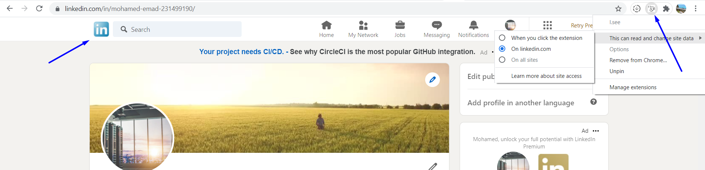
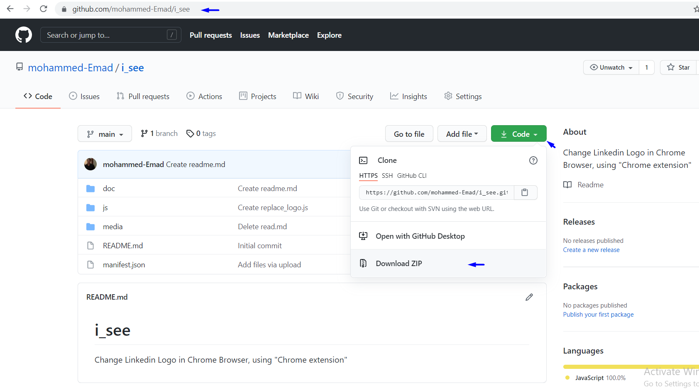
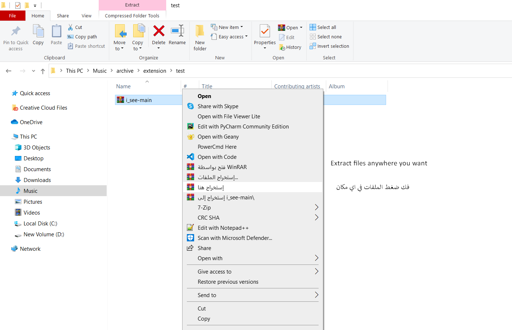
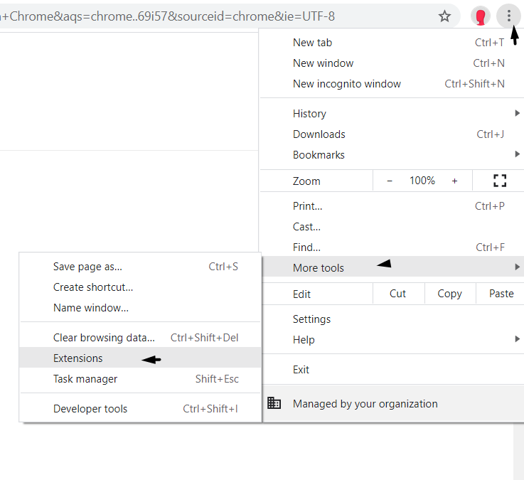
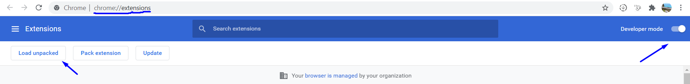
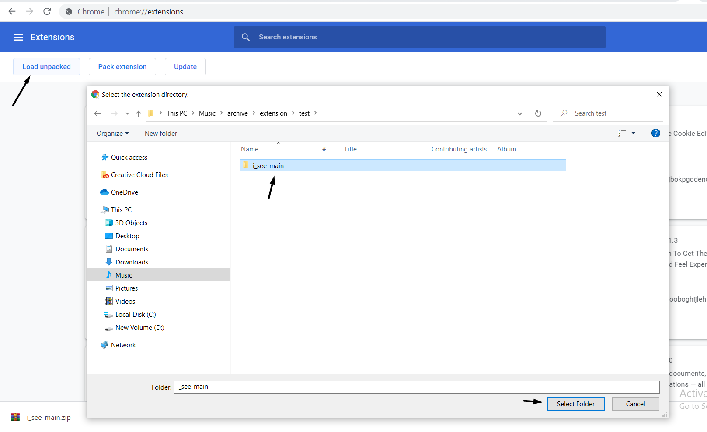
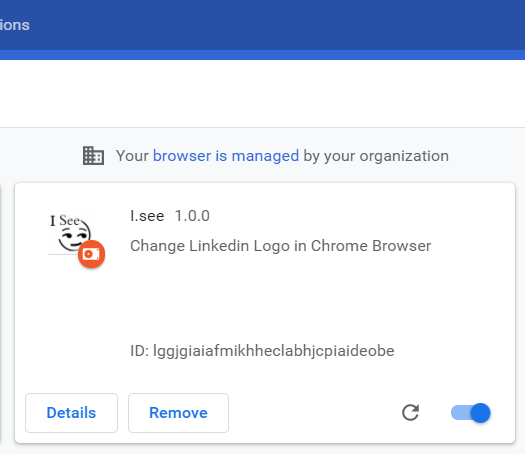
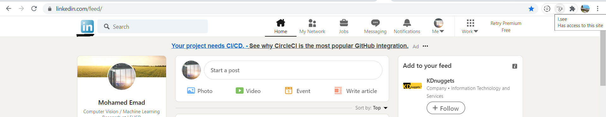

# i_see
Change Linkedin Logo in Chrome Browser, using "Chrome extension"

**Restore the old logo** 

# To install the extension, follow the steps below
# لتثبيت الاضافة علي جوجل كروم تابع الخطوات التالية

**Download [repo](https://github.com/mohammed-Emad/i_see) as zip file**

**Extract files anywhere you want..**

**go to extensions Tab [chrome://extensions](chrome://extensions) go**

**Activate developer mode in Chrome.**

**Choose the folder path from the Chrome Extensions tab**

**You will see something like this**

**Now go to your [LinkedIn](https://www.linkedin.com/) account and update the page**

**Done**

